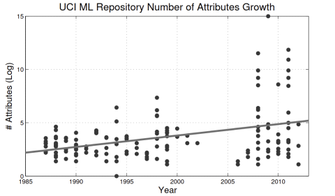
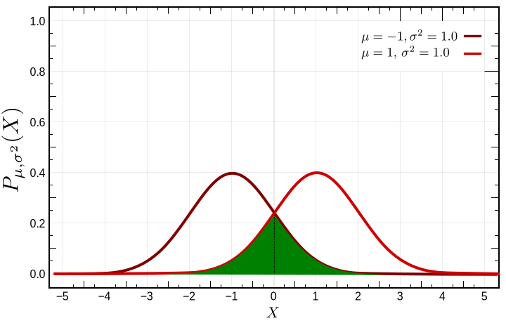
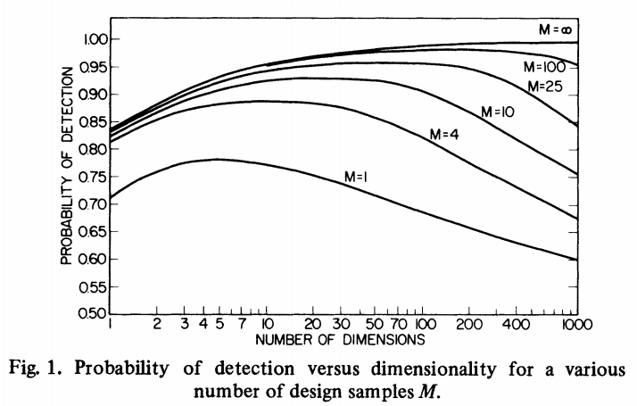
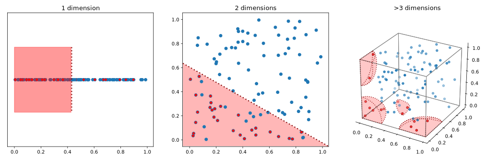
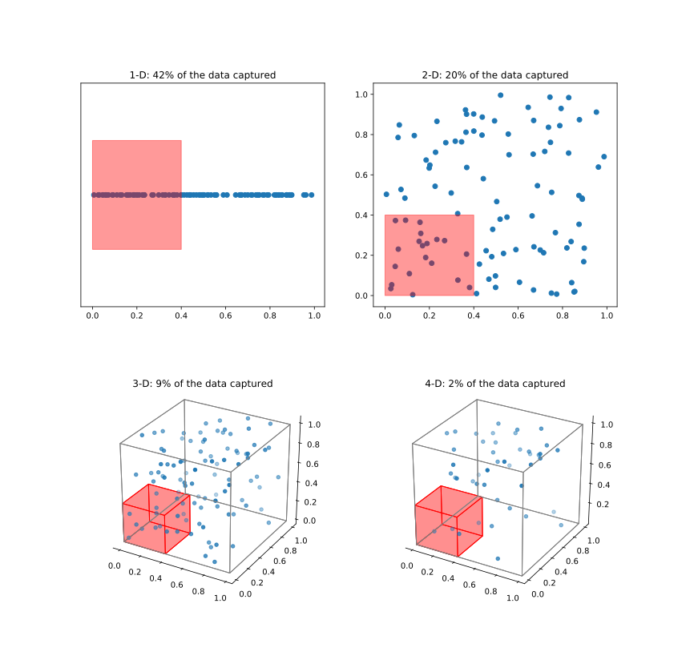

In an attempt to understand any sort of phenomenon, when faced with many potential factors, we tend to stick to those indicating of having a closer relationship with the outcome. If you, unfortunately, have a case of the runs, a doctor might first check if you had anything odd to eat, presented any other symptoms or even ask for the dreaded stool test instead of requesting an invasive biopsy right of the bat. With this approach, we may be implicitly exercising the pertinent cliché popularized by Willian of Occam' (aka the principle of parsimony)

> _"Entities should not be multiplied without necessity."_

"When presented with competing hypotheses that make the same predictions, one should select the solution with the fewest assumptions". Going back to the diagnosis, a doctor probably would initially relate the case with a direct root cause, such as the shady meals you've been eating rather than a claim of colon cancer, since there may not be enough evidence to suggest it. (which can be tested much easier https://plato.stanford.edu/entries/simplicity/)

---

Consider leaving a <a class="github-button" href="https://github.com/GEIA-UFSC/feature_selection" data-icon="octicon-star" data-size="small" data-show-count="true" aria-label="Star this on GitHub">Star</a> if this helps you.

---

Contemporary philosophers have tended to reinterpret OR as a principle of theory choice: OR implies that—other things being equal—it is rational to prefer theories which commit us to smaller ontologies. This suggests the following paraphrase of OR:

(OR1) Other things being equal, if T1 is more ontologically parsimonious than T2 then it is rational to prefer T1 to T2.
What does it mean to say that one theory is more ontologically parsimonious than another? The basic notion of ontological parsimony is quite straightforward, and is standardly cashed out in terms of Quine's concept of ontological commitment. A theory, T, is ontologically committed to Fs if and only if T entails that F's exist (Quine 1981, pp. 144–4). If two theories, T1 and T2, have the same ontological commitments except that T2 is ontologically committed to Fs and T1 is not, then T1 is more parsimonious than T2. More generally, a sufficient condition for T1 being more parsimonious than T2 is for the ontological commitments of T1 to be a proper subset of those of T2. Note that OR1 is considerably weaker than the informal version of Occam's Razor, OR, with which we started. OR stipulates only that entities should not be multiplied beyond necessity. OR1, by contrast, states that entities should not be multiplied other things being equal, and this is compatible with parsimony being a comparatively weak theoretical virtue.

Since Occam's Razor ought to be invoked only when several hypotheses explain the same set of facts equally well, in practice its domain will be very limited…[C]ases where competing hypotheses explain a phenomenon equally well are comparatively rare (Holsinger 1980, pp. 144–5). 

Read: Justifications of Simplicity https://plato.stanford.edu/entries/simplicity/
---

(https://en.wikipedia.org/wiki/Minimum_description_length)

<a>&nbsp;&nbsp;What is a feature</a>    

<i> In machine learning and pattern recognition, a **feature** (or an attribute) is an individual measurable property or characteristic of a phenomenon being observed.<a href="#References">[1]</a></i>
 

 
So what if instead of diagnosing one patient, we took a step further and focus to find the factors linked to a disease, let's say colon cancer. By constraining the problem to investigate only genetic traits this can even seem easier, since we are dealing with a bounded set of possibilities.  However, in this case the number of equally potential factors is such that impedes us humans to understand the big picture. A dataset mapping to colon cancer presents more than 2.000 characteristics, or features [[4]](#References). And many other aplications in data analysis generally present equal or greater amounts of information.

2009: ImageNet - 14 million images with 256x256 pixels (+196k features) each, and more than 20,000 categories <a style="font-size:0.6em;" href="#References">[2]</a>

2010: The Wikipedia Corpus - almost 1.9 billion words from more than 4 million articles <a style="font-size:0.6em;" href="#References">[3]</a>

2011: Cancer detection based on gene expression (e.g.: Colon dataset - 2,000 features) <a style="font-size:0.6em;" href="#References">[4]</a>

 

ImageNet: 256x256x3 = 196608

Wikipedia: 1.9 billion words, not distinct, of course - the Second Edition of the 20-volume Oxford English Dictionary, published in 1989, contains full entries for 171,476 words in current use, and 47,156 obsolete words.

The tendency for "wider" amounts of information has increase over the years, probably related to our increase in storage and processing capabilties. We can observe this trend in a UBC dataset survey. Before the 2000s, very few domains operated with more than 40 features and soon after we have more than XX.

Source: <a href="#References">[5]</a>

# 2. The problem

2. The problem

<h3>Too many features, too many problems</h3>

<i>What problems arise with too many features?</i>

---

1. require longer training times*

2. jeopardize human interpretability*

3. worsen prediction quality due to sample size effects

4. potentially increase overfitting

* Considered self-explainatory, will not be further explained

<h4>3. Worsen prediction quality due to sample size effects</h4>

<i>Couldn't a predictor simply disregard irrelevant features?</i>

---

To answer this, we will have to resort to some statistical learning theory, exploring the ways of estimating functional dependency from a given collection of data.

<h5>Statistical Learning Theory</h5>

Let $$X \in \mathbb R^p$$ be a input random vector and $Y\in \mathbb R$ be an output random variable, with joint distribution $P(X,Y)$.

The task of learning aims at finding a function $f(X)$ for predicting $Y$ given values of input $X$. This structure requires a *loss function* $L(Y, f(X))$ for identifying and penalizing errors in prediction. With this structure, we can define a criterion for choosing a suitable $f$ known as the *Statistical Risk ($R$)*.

$$
\begin{equation}
\begin{split}
\text{R}(f) & =  \mathbb{E} \thinspace L(Y, f(X)) \\
 & = \int L(y, f(x))\thinspace P(dx,dy) \\
 & = \mathbb{E}_{X}\mathbb{E}_{Y|X} [L(Y, f(X))|X]
\end{split}
\end{equation}
$$

Source: <a href="#References">[5]</a>

This criterion tells us how well, on average, the predictor $f$ performs with respect to the chosen loss function

Instead of working with the joint distribution, we can condition the Statistical Risk on $X$

$$
\begin{equation}
\begin{split}
\text{R}(f) & = \int\int [L(y, f(x))|x]\thinspace P(dy)\thinspace P(dx) \\
 & = \mathbb{E}_{X}\mathbb{E}_{Y|X} [L(Y, f(X))|X]
\end{split}
\end{equation}
$$

Finally, what we seek is a $f(X)$ which minimizes the the Risk:
 

$$f(X)_{opt}= argmin_c \mathbb{E}_{X}\mathbb{E}_{Y|X}[L(Y,c)|X]$$

The optimal solution will be different depending on the metric used

<h5>Regression</h5>
<h6>Mean Squared Error (MSE)</h6>
 

$$
\begin{equation}
\begin{split}
f(X)_{opt} & = argmin_c \mathbb{E}_{X}\mathbb{E}_{Y|X}[(Y-c)^2|X] \\
 & = \mathbb{E}(Y|X=x)
\end{split}
\end{equation}
$$

known as the conditional mean or expectation - the "average" value over an arbitrarily large number of occurrences
<h6>Mean Absolute Error (MAP)</h6>
 

$$
\begin{equation}
\begin{split}
f(X)_{opt} & = argmin_c \mathbb{E}_{X}\mathbb{E}_{Y|X}[|Y-c|\thinspace|X] \\
 & = median(Y|X=x)
\end{split}
\end{equation}
$$

or the conditional median of the distribution

<h3>Regression loss functions for SLT</h3>

**MSE**: the most preferable option, due to its ease of computation of minimum, since it is differentiable. However it is more sensitive to outliers as a big difference becomes even larger by squaring them. 

**MAP**: its optimal estimates are more robust than those for the conditional mean. However, MAP has discontinuities in their derivatives, which have hindered their widespread use.

<h5>Classification</h5>
<h6>0-1 loss</h6>

$$
\begin{equation}
\begin{split}
f(X)_{opt} & = argmin_c \mathbb{E}_{X}\mathbb{E}_{Y|X}[I(f(X),Y)] \\
 & = \underset{y \in Y}{\max}P(y|X)
\end{split}
\end{equation}
$$

where ${\displaystyle I}$ is the indicator function:

$$I :=\begin{cases}
0\text{, if } f(X) = Y\\
1\text{, otherwise}\\
\end{cases}$$

The decider is also known as the *Optimal Bayes classifier* (revise this).

If the joint probability $P(X,Y)$ is known and the classification decision is optimal.

This doesn't mean that there are no errors, rather than the lowest error achievable, resulted by noise among distributions.

If the probability distribution for the problem was known, the classifier wouldn't be affected by adding more of features.

If such features carried the slightest contributions, it is shown that the Bayes optimal classifier tends to zero as the number of features approach infinity.

However, the probability distribution used is an estimation, based on the finite set of samples, causing a **peaking phenomenon**: the prediction accuracy increases with the number of features, but soon reaches a peak, in which the noise becomes larger than the separability increase caused by the new feature.

Source: <a href="#References">[6]</a>

This is often called the peaking phenomenon. Some ideas evolved around it are discussed in the great pattern recognition blog by Ela Pekalska and Bob Duin called [37steps](http://37steps.com/about/):
 - [Peaking summarized](http://37steps.com/2545/peaking-summarized/)
 - [Peaking paradox](http://37steps.com/2279/the-peaking-paradox/)
 - [Trunk’s example of the peaking phenomenond](http://37steps.com/2448/trunks-example/)
 - [The curse of dimensionality](http://37steps.com/2349/curse-of-dimensionality/)
 

<h4> 4. potentially increase overfitting</h4>

As the number of features increase, the observations become more sparse within the feature space.

 
<table>
    <tr>
        <td>
            
        </td>    
        <td style="font-size:3em; width: 700px; word-wrap: break-word;">
            
Having the observations further apart makes it difficult for the estimator to generalize, increasing its variance, i.e. relying on the specific observations to produce new predictions, causing overfitting.

        </td>
    </tr>
</table>

Consequences for classical:

**Non-parametric (Local methods)**: methods such as the $k$ *nearest neighboors*, as the examples become increasingly sparse, the approximation of the conditional expectation by taking the average of its nearest neighboors becomes correspondingly worse as the query point distance itself from the known examples. Additionally, in high dimensions, as the datapoints become more spread apart, their distances become more uniform, making it dificult for the algorithm to decide which data points are more relevant to region of interest [Source](https://www.youtube.com/watch?v=dZrGXYty3qc&list=PLXP3p2MXX_ahmhsMiP5YWtc7IcABeFOGH&index=2)

**Parametric methods**:  In very high dimensional spaces, there is more than one plane that can be fitted to your data, and without proper type of regularization can cause the model to behave very poorly. . Collinearity often results in overfitting, i.e. in a too efficient modelling of learning samples without model generalization ability. [[7]]()

More examples on  check the answer on [stackexchange](https://stats.stackexchange.com/questions/186184/does-dimensionality-curse-effect-some-models-more-than-others)

What causes these problems?

<i>The curse of dimensionality</i>

<h3>The curse of dimensionality</h3>
 
<table>
    <tr>
        <td>
            
        </td>    
        <td style="font-size:3em; width: 700px; word-wrap: break-word;">
            
Increasing the number of factors to be taken into consideration requires an exponential growth of observations <a href="#References">[5]</a>  
           However, having a small number of samples means that many regions of the feature space are never observed

        </td>
    </tr>
</table>

<h1>References</h1>
 

<a href="https://www.amazon.com/Pattern-Recognition-Learning-Information-Statistics/dp/0387310738">[1]</a>    : Bishop, C. (2006). Pattern recognition and machine learning  
<a href="http://jmlr.csail.mit.edu/papers/volume3/guyon03a/guyon03a.pdf">[2]</a>    : Guyon, I. and Elissee, A. (2003). An Introduction to Variable and Feature Selection 
<a href="http://image-net.org/challenges/LSVRC/">[3]</a>: Russakovsky, O., Deng, J., Su, H., Krause, J., Satheesh, S., Ma, S., Huang, Z., Karpathy, A., Khosla, A., Bernstein, M., C. Berg, A. and Fei-Fei, L. (2015) ImageNet Large Scale Visual Recognition Challenge. IJCV, 2015 
<a href="https://snap.stanford.edu/data/wiki-meta.html">[4]</a>:Kossinets, G. (2010). Processed Wikipedia Edit History. Stanford large network dataset collection 
<a href="https://www.ncbi.nlm.nih.gov/pmc/articles/PMC3287491/">[5]</a>: Liu, Q., Sung, A. H., Chen, Z., Liu, J., Chen, L., Qiao, M., Deng, Y. (2011). Gene selection and classification for cancer microarray data based on machine learning and similarity measures. 
<a href="https://www.springer.com/gp/book/9780387848570">[6]</a>: Hastie, T., Tibshirani, R., and Friedman, J. H. (2009). The elements of Statistical learning: data mining, inference, and prediction. 
<a href="https://ieeexplore.ieee.org/document/4766926">[7]</a>: Trunk, G. V. (1979). A Problem of Dimensionality: A Simple Example 
    <a href="https://link.springer.com/chapter/10.1007/11494669_93">[8]</a>: Verleysen, M. and François, D. (2005). The Curse of Dimensionality in Data Mining and Time Series Prediction 
     <a href="   http://papers.nips.cc/paper/2020-on-discriminative-vs-generative-classifiers-a-comparison-of-logistic-regression-and-naive-bayes.pdf">[9]</a>: Ng, A. Y. and Jordan, M. I. (2001). On Discriminative vs. Generative Classifiers: A comparison of logistic regression and naive Bayes 
     <a href="   https://arxiv.org/abs/1601.07996">[10]</a>: Li, J., Cheng, K., Wang, S., Morstatter, F., Trevino, R. P., Tang, J., and Liu, H. (2017). Feature Selection: A Data Perspective 
    <a href="   https://www.sciencedirect.com/science/article/pii/S1088467X97000085">[11]</a>: Dash, M. and Liu, H. (1997). Feature selection for classification 
    <a href="https://www.researchgate.net/publication/2771488_Feature_Subset_Selection_as_Search_with_Probabilistic_Estimates">[12]</a>: Kohavi, R. (1994). Feature Subset Selection as Search with Probabilistic Estimates 
    <a href="https://www.researchgate.net/publication/288257551_Feature_selection_for_classification_A_review">[13]</a>: Tang, J., Alelyani, S., Liu, H. (2014). Feature selection for classification: A review 
    <a href="https://www.sciencedirect.com/science/article/pii/S0304397597001151">[14]</a>: Amaldi,E., Kann, V. (1998). On the approximability of minimizing nonzero variables or unsatisfied relations in linear systems 
    <a href="https://dl.acm.org/citation.cfm?id=2577699">[15]</a>:Chandrashekar, G., Sahin, F. (2014). A survey on feature selection methods 
      <a href="https://ieeexplore.ieee.org/document/1674939/">[16]</a>: Narendra, P. M., Fukunaga, K. (1977). A Branch and Bound Algorithm for Feature Subset Selection 
          <a href="https://www.amazon.com/Modern-Heuristic-Search-Methods-Rayward-Smith/dp/0471962805">[17]</a>: Rayward-Smith, V., Osman, I., Reeves, C. D., Smith, G. (1996). Modern Heuristic Search Methods 
      <a href="https://bib.irb.hr/datoteka/763354.MIPRO_2015_JovicBrkicBogunovic.pdf">[18]</a>: Jović, A., Brkić, K., and Bogunović, N. (2015). A review of feature selection methods with applications 

