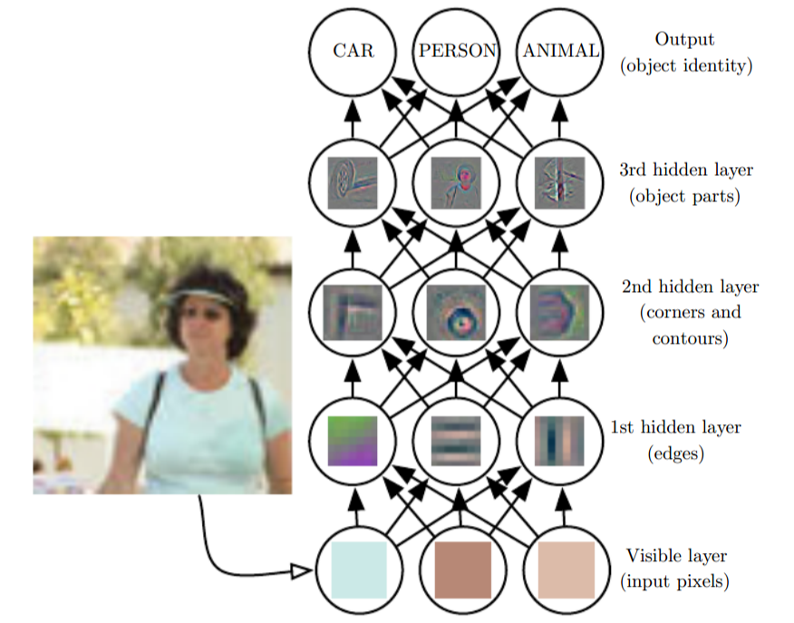
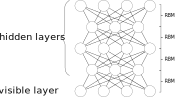
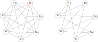
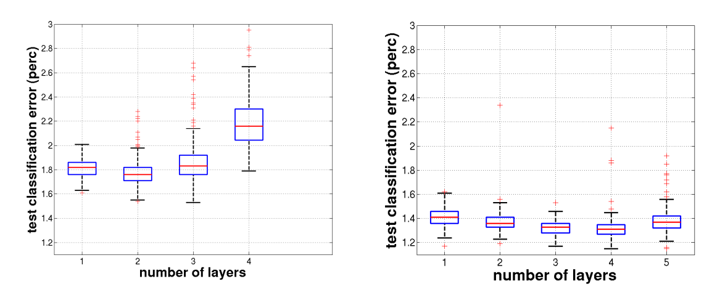
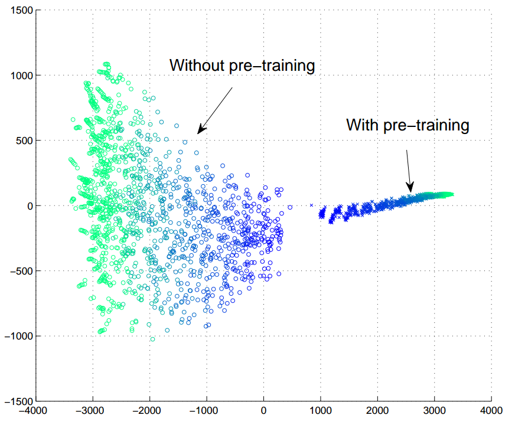
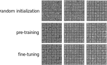

---
layout: post
title:  "Obstacles along deep learning evolution: saturation"
date:   2019-05-09 00:00:00 -0500
comments: true
categories:
---

Deep learning (deep structured learning or hierarchical learning) can be defined as _“a class of machine learning techniques that exploit many layers of non-linear units”_ ([Deng and Yu (2013, pg. 199)](#References)). Traditionally, shallow architectures with only one or two non-linearities have been most useful in machine learning. For complicated, highly varying functions, however, deep architectures are necessary to learn with reasonable sample complexity ([Bradley (2010, pg. 22)](#References)). This is achieved through its ability to derive complex feature hierarchies from low-level inputs, by substantially coupling non-linear operations throughout layers whose parameters, in turn, rearrange, gradually adapting to a target function.

Compositional representation of features throughout layers: from pixels to gradients and edges.  Source: [Goodfellow et al. (2016, pg. 6)](#References)

Features of an input can be progressively exploited as the number of layers in a neural network increase, establishing network depth as a determinant factor of success in models, especially in intricate tasks such as image recognition. Furthermore, researches and outlines such as [He et al. (2015, pg. 2)](#References), [Bengio (2009, pg. 6)](#References), and [Krizhevsky et al. (2012, pg. 1)]((#References)) indicate performance improvement upon an increase in network depth.

Yet, the absolute number of layers in a network is not the important factor, rather how many layers necessary to effectively represent the target function, denominated as a compact representation. As [Bengio (2009, pg. 9)]((#References)) describes:

> More precisely, functions that can be compactly represented by a depth $k$ architecture might require an exponential number of computational elements to be represented by a depth $k-1$ architecture. Since the number of computational elements one can afford depends on the number of training examples available to tune or select them, the consequences are not just computational but also statistical: poor generalization may be expected when using an insufficiently deep architecture for representing some functions.

So, ideally, a function may require a number of layers to be represented in a computationally efficient manner. [Bengio (2009)](#References), however, does not imply any counterpoints to stacks of layers greater than required by the function. In theory, such configuration may pose as harmless, since the spare layers could simply replicate their input. However, many challenges are confronted as the depth of networks increase.

---

Consider leaving a &nbsp<a class="github-button" href="https://github.com/artur-deluca/artur-deluca.github.io" data-icon="octicon-star" data-size="small" data-show-count="true" aria-label="Star this on GitHub">Star</a> &nbsp if this helps you.

---

## The challenges of training deep networks
 
Despite the remarked capacity, deep architectures were not widely researched as today. The reasons for this may encompass more than just technical aspects, such as the former contemptuous view of researchers on this topic, or the overall impotent computation capability compared to contemporary standards. This, however, will not be covered in this study. The technical challenges of such architectures were posed by the difficulty in training neural networks with more than two layers, ultimately delivering poor generalization (Bengio et al. (2007))1.

In this series, many of the predicaments faced during the early and recent development of deep learning are going to be described with their corresponding solutions.
<a></a>    

[1] [Bengio (2009, pg. 24)](#References) appropriately points that Convolutional Neural Networks with up to seven layers did not suffer as other types of models. This may be due to what the author denominates as a Topographic Structure, suggesting that each neuron in a layer is associated with a small portion of the input. From this, two favorable aspects are hypothesized: the gradient is propagated in a less diffuse way and this hierarchical local connectivity structure may be more suited for image recognition tasks, which is the most common use for such architecture.

### Problem: Layer saturation 

In the early development of neural networks, the initialization of parameters was performed by sampling a uniform distribution bounded to a predetermined interval. In this process, the weights and biases produced solutions that would generally lie very far from local optima, requiring many training iterations to readjust. Shallow networks did not severely suffer from this due to the smaller number of parameters, presenting an easier system to be optimized. However, as the depths of networks increased, so did its complexity and the difficulty to train such models using this formerly common initialization process.

Glorot and Bengio (2010) promoted a study to investigate the reason for random initialization to perform so poorly in deep networks. For the investigation, the authors considered one common initialization heuristic, introduced by LeCun et al. (1998), that defines the biases at 0 and the weights via sampling according to the following distribution:

$$W_{ij}\sim U\left[-\frac{1}{\sqrt{n}},\frac{1}{\sqrt{n}}\right]$$

where $n$ is the number of inputs to the unit. The authors then verified that in deep configurations of 4 to 5 layers, activation values on the last layers got stuck in plateaus situated at the extremes of the activation function, instance otherwise known as saturation.

Saturation regions on the sigmoid function. In the case observed by [Glorot and Bengio (2010)](#References), the saturation occured in the 5th and last layer of the network, with activation values converging to zero.

One hypothesized explanation for saturation on sigmoid-equipped deep networks is that the random initialization does not provide useful information to the last layer of the network, that starts to rely more on its biases, which, in turn, are trained faster than its weights. Gradually but rapidly, the error gradient tends to push the activations towards zero in an attempt to suppress the influence of the previous layers. Eventually, the saturation may be overcome but the overall result would be of poor generalization.

### Unsupervised pre-training

Layer saturation was the biggest technical hurdle that limited the progress of deep learning in the dawn of the millennium. In 2006, however, [Hinton et al. (2006)](#References) inspired by a well-established procedure, developed a novel approach to initialize the parameters of a Deep Belief Network — a class of neural networks — what in time overcame the saturation issue and surpassed performance ever seen using deep architectures. These results not only re-sparked but drastically expanded researchers interest in this field.

A Deep Belief Network (DBN) can be seen as a stack of smaller unsupervised learning algorithms named Restricted Boltzmann Machines. This configuration can then be bundled with a classical multi-layer perceptron for supervised learning tasks

This initialization procedure encompassed an unprecedented process: an unsupervised greedy layer-wise pre-training step.2 Preceding the conventional supervised training, each layer is trained with its anterior neighboring layer identically to a Restricted Boltzmann Machine. This process starts with the input and first layer, and progressively advance one layer at a time until it sweeps all layers.

A Boltzmann Machine is an unsupervised generative algorithm that learns the data representation by associating the patterns identified in the inputs to probabilistic configurations within its parameters. A Restricted Boltzmann Machine is a variation of such a model that reproduces a similar behavior but with significantly fewer connections.
   

[2] Despite the imprecision, unsupervised pre-training is here used interchangeably

A Boltzmann Machine (<i>left</i>) and a Restricted Boltzmann Machine (<i>right</i>)

Many other unsupervised pre-training algorithms were developed concomitantly or immediately after, such as autoencoders [(Bengio et al. (2007))](#References), denoising autoencoders [(Vincent et al. (2008))](#References), contractive autoencoders [(Rifai et al. (2011))](#References), among others.

Comparison of performance between networks running without pre-training (<i>left</i>) and with pre-training (<i>right</i>)  Source: [Erhan et al. (2010, pg. 636)](#References)

Why does this unsupervised learning methods help training deep architectures? Much of the explanation remains uncertain. Nonetheless, [Erhan et al. (2010)](#References) provide some clarifications through considerable experimentation. The claims of the authors reside on two possible, but not mutually exclusive reasons: <i>optimization</i> and <i>regularization</i>.

Deep neural networks are composed of many parameters whose values are used to compute an approximation of a function. Due to its substantial nonlinear nature, this approximation yields a non-convex function that poses a challenge on searching the best combination of weights and biases.3

A convex (left) and non-convex (right) function. Note that, contrarily to the convex function, the non-convex function possesses multiple local optima. Source: [Zadeh (2016)](#References)

[3] Many discussions today in academia evolve around the particular shape of loss landscape in deep neural networks, since many of the local minima appear to have equally good qualities, suggesting that the critical solutions reached during training are actually saddle points. This discussion will be reserved to further studies.

Gradient-based methods employed in training eventually converge to their pre-selected basin of attraction, a region of the function space, such that any point in it eventually is iterated into the attractor. Unsupervised pre-training may work towards optimization by favoring a basin of attraction that might yield a lower training error. Thus, since the gradients are very prompt to abrupt changes, backpropagation is only used at a local search level, from an already favorable starting point [(Hinton (2012, lecture 14b))](#References).

As for <i>regularization</i>, one may commonly associate it with explicit techniques, such as the L1 or L2 norm:

$$C=-\frac{1}{n}\sum_{j}\left[y_j\ln a_j^{L}+\left(1-y_j\right)\ln\left(1-a_j^{L}\right)\right]+\frac{\lambda}{2n}\sum_iw_i{{}^2}$$

By adding the <i>L2 regularization</i> factor in the cross-entropy cost function, presented in the equation above, one can penalize overly complex models, that would result in poor generalization, i.e. <i>high testing error</i>. However, the regularization employed by pre-training is implicit. In attempt to model how such technique would work explicitly, [Erhan et al. (2009)](#References) defines a regularization term such as:

$$regularizer=-log\,P\left(\theta\right)$$

The function $P\left(\theta\right)$ describes the probability that the weights of the neural network are initialized as $\theta$. So, if a configuration shows to be highly improbable, the regularizer term will hurt the cost function strongly. Furthermore, if the probability of landing such set of parameters is high, the regularizer will then reward the cost function. This probability is governed by the initialization methods employed. Considering two instances with and without pre-training, we obtain:

$$P\_{{\text{pre-training}}}(\theta) = \sum_k\frac{1\_{\theta \in R_k}\pi\_k}{v_k}$$

and

$$P\_{{\text{no pre-training}}}(\theta) = \sum_k\frac{1\_{\theta \in R_k}r_k}{v_k}$$

 
where $R_k$ is the basin of attraction that contains $\theta$, and $1\_{\theta \in R_k}$ is the identifier function – unitary for all $\theta$ in $R_k$, otherwise null. Additionally, $\pi_k$ and $r_k$ are the probabilities of landing in the basin of attraction $R_k$, which has a volume $v_k$. Since the basins of attraction are disjunct sets, the probability density function of the set of parameters located in $R_k$ is uniform, calculated by taking the probability of landing in the k-th basin ($\pi_k$ or $r_k$) and dividing by its volume.

Pre-training the parameters of the network conditions the network initialization to land on regions of better generalization. This is hypothetically achieved by increasing the $\pi_k$'s where the network parameters represent meaningful variations of the input, contributing to predict the output. For this reason, pre-training also reduces the variance upon parameter initialization.

2-D visualization of parameters' trajectory of 100 neural networks with and without the unsupervised pre-training step. The color gradient from dark-blue to cyan symbolizes the progression of iterations.  Source: [Erhan et al. (2010, pg. 541)](#References)

The visualization of the parameters' trajectory may demonstrate the effects of optimization and regularization. As mentioned through the former, it may select a basin of attraction with lower training errors. Conversely, regularization may bound the parameter interval to a range that yields good generalization. Also, it is crucial to notice that both training and testing errors collected in the experiments of [Erhan et al. (2010)](#References) support these hypotheses, but do favor the latter.

Furthermore, once established within the solution space, the parameters do not drastically change during the gradient-based adjustment process. In fact, this process is also denominated fine-tuning, as it only modifies the features slightly to get the category boundaries, rather than discovering new relationships ([Hinton (2012, lecture 14b)](#References)).

Visualization of filters of a Deep Belief Network used to recognize digits form the MNIST data-set after the different training processes; from left to right: units from the first, second and third layers, respectively.  Source: [Erhan et al. (2010, pg. 638-639)](#References)

But how can one conceptually understand the effects of unsupervised learning? Apart from regularization and optimization hypothesis, the layer-wise pre-training resembles the underlying distribution of the input. Ideally, this representation, by combining the different features and mapping their inner relationships, can unveil, and more importantly, disentangle causal elements that influence the output. If those inputs can be transformed in uncorrelated features, it is possible to solve for a particular parameter disregarding its influence over the others.

As mentioned in [Goodfellow et al. (2016, pg. 541)](#References), this hypothesis justify approaches in which one first seeks a good representation for $p(x)$ before training with the output. If the output is closely related to factors captured by the input, an initialization that captures the distribution of x is useful for predicting the desired output distribution $p\left(y|x\right)$.

However, despite the aforementioned advantages, unsupervised pre-training presents noteworthy drawbacks, such as establishing two separate learning stages (unsupervised and supervised). As a consequence, there is a long delay between adjusting hyperparameters on the first stage utilizing feedback from the second. Additionally, although pre-training being considered a valuable regularizer, its strenght adjustment is troublesome, requiring a somewhat unclear modification of far many hyperparameters — contrasting with explicit regularization techniques that can be adjusted by a single one.

<h1>References</h1>
<ul style="font-size:0.6em;">
    <li>Bengio, Y. (2009). Learning Deep Architectures for AI. Foundations and Trends in Machine Learning. 1-127.</li>
    <li>Bengio, Y., Lamblin, P., Popovici, D., and Larochelle, H. (2007). Greedy Layer-Wise Training of Deep Networks. In Advances in Neural Information Processing Systems 19, 153-160.</li>
    <li>Bradley, D. M. (2010). Learning In Modular Systems. PhD Thesis, Carnegie Mellon University.</li>
    <li>Deng, L. and Yu, D. (2013). Deep Learning: Methods and Applications.
    Foundations and Trends in Signal Processing, 7-197.</li>
    <li>Erhan, D., Bengio, Y., Courville, A., Manzagol, P.A., Vincent, P., and Bengio, S. (2010). Why Does Unsupervised Pre-training Help Deep Learning? Journal of Machine Learning Research, 11-36.</li>
    <li>Erhan, D., Manzagol, P.A., Bengio, Y., Bengio, S., and Vincent, P. (2009). The Difficulty of Training Deep Architectures and the Effect of Unsupervised Pre-Training. Artificial Intelligence and Statistics, 153-160.</li>
    <li>Glorot, X. and Bengio, Y. (2010). Understanding the diffculty of training deep feedforward neural networks. Proceedings of the Thirteenth International Conference on Artificial Intelligence and
    Statistics , pages 249-256.</li>
    <li>Goodfellow, I., Bengio, Y., and Courville, A. (2016). Deep Learning. MIT Press.</li>
    <li>He, K., Zhang, X., Ren, S., and Sun, J. (2015). Deep Residual Learning for Image Recognition. Proceedings of the IEEE conference on computer vision and pattern recognition.</li>
    <li>Hinton, G. (2012). Neural Networks for Machine Learning. Coursera Online Course.</li>
    <li>Hinton, G. E., Osindero, S., and Teh, Y.-W. (2006). A Fast Learning Algorithm for Deep Belief Nets. Neural Computation , 1527-1554.</li>
    <li>Krizhevsky, A., Sutskever, I., and Hinton, G. E. (2012). ImageNet Classification with Deep Convolutional Neural Networks. Advances in Neural Information Processing Systems 25, 1097-1105.</li>
    <li>LeCun, Y. A., Bottou, L., Orr, G. B., and Müller, K.-R. (1998). Efficient BackProp. Neural Networks: Tricks of the Trade, 9-48.</li>
    <li>Rifai, S., Vincent, P., Muller, X., Glorot, X., and Bengio, Y. (2011).
    Contractive Auto-encoders: Explicit Invariance During Feature Extraction. Proceedings of the 28th International Conference 
    on Machine Learning, 833-840.</li>
    <li>Vincent, P., Larochelle, H., Bengio, Y., and Manzagol, P.-A. (2008).
    Extracting and Composing Robust Features with Denoising Autoencoders. Proceedings of the 25th International Conference, 1096-1103.</li>
    <li>Xu, B., Huang, R., and Li, M. (2016). Revise Saturated Activation Functions.</li>
    <li>Zadeh, R. (2016). The hard thing about deep learning. O'Reilly Media.</li>
</ul>

